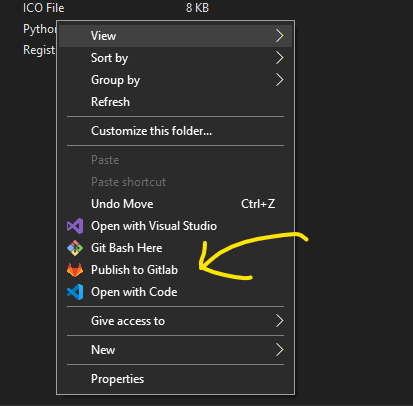

### Publish to Gitlab



Publish any folder to Gitlab with one click(should be working with github too)

**Prerequisites**

This script uses ssh method

So, first create your public ssh key. Add it to your account

Login with ssh

```bash
ssh git@gitlab.com
```

Locate your python path and add it to the .reg

Copy all the files to `c:\publish-to-gitlab` folder.

Then add the command via the .reg file

That's it.

How the python script works?
---
- Initialize a new git repo with `main` branch
- Add all the files to staging area
- Commit changes 
- Add upstream to the repo and push the changes to remote

> If  a repo already exists it avoids executing.

